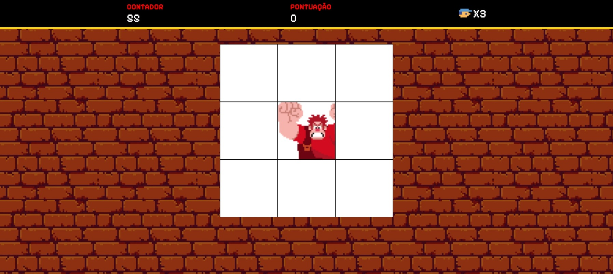

# 🎮 Detona Ralph - Game JS

Um jogo inspirado no filme "Detona Ralph" desenvolvido em JavaScript puro! O objetivo é acertar o Ralph quando ele aparecer nos quadrados do painel antes que o tempo acabe.

## 🕹️ Jogar Online

**[🎯 Clique aqui para jogar agora!](https://rafaeloliveiraz.github.io/detona-ralph-gamejs)**

## 🎯 Como Jogar

- O Ralph aparecerá aleatoriamente em um dos 9 quadrados
- Clique no quadrado onde o Ralph está para marcar pontos
- Cuidado! Clicar fora do Ralph fará você perder uma vida
- O jogo termina quando o tempo acabar ou suas vidas chegarem a zero

## 🛠️ Tecnologias Utilizadas

- HTML5
- CSS3
- JavaScript (Vanilla)

## 🚀 Próximas Funcionalidades

Estamos trabalhando nas seguintes melhorias para tornar o jogo ainda mais divertido:

- ❤️ **Sistema de Vidas**: Implementar lógica completa onde clicar fora do Ralph reduz uma vida
- 🏆 **Sistema de Ranking**: Salvar as melhores pontuações no cache local
- 🎬 **Tela de Abertura**: Adicionar uma tela inicial com botão de start
- 📈 **Sistema de Níveis**: Aumentar dificuldade com maior velocidade e mais blocos
- 🎵 **Melhorias Sonoras**: Expandir os efeitos sonoros do jogo

## 🤝 Contribuindo

Adoraríamos receber suas contribuições! Para contribuir:

1. Faça um fork do projeto
2. Crie uma branch para sua feature (`git checkout -b feature/MinhaFeature`)
3. Commit suas mudanças (`git commit -m 'Adiciona nova feature'`)
4. Push para a branch (`git push origin feature/MinhaFeature`)
5. Abra um Pull Request

Sinta-se à vontade para enviar sugestões, reportar bugs ou propor melhorias através das issues!

---

⭐ Se você gostou do projeto, não esqueça de dar uma estrela!

